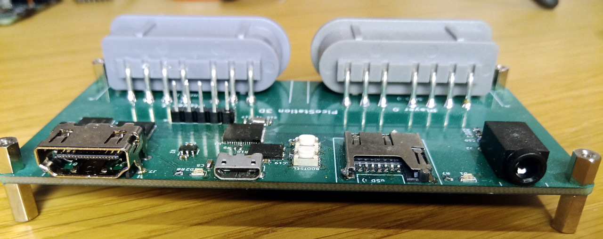

PicoStation 3D
==============

This is an **unfinished, untested** project to develop a 3D games console based on an RP2040 microcontroller and an iCE40 UP5k FPGA. Quick links:

- [Board Schematic (PDF)](board/picostation.pdf)
- [RP2040 Datasheet (PDF)](https://datasheets.raspberrypi.org/rp2040/rp2040-datasheet.pdf)
- [FPGA Datasheet (PDF)](http://www.latticesemi.com/-/media/LatticeSemi/Documents/DataSheets/iCE/iCE40-UltraPlus-Family-Data-Sheet.ashx)

From left to right, the components on the top edge are:

- A 3.5mm TRS audio jack, connected straight to RP2040 GPIOs via an RC filter (no separate audio supply on this board rev)
- A status LED for the RP2040
- A micro SD receptacle connected to the RP2040
- A micro USB socket providing power to the board, and code download and serial comms via the RP2040
- A status LED for the FPGA
- An HDMI socket for DVI-D video output, connected to the FPGA

The bottom edge has two SNES controller sockets. Also on the board is an 8MiB HyperRAM connected to the FPGA.

There is a RESET and BOOTSEL button for the RP2040, for quick firmware updates over USB, but the debug header (UART + SWD) is a better solution for iterating and developing code.

There are 12 wires connecting the FPGA to the microcontroller, one of them going from a GPOUT clock output on the RP2040 to a GB_IN global clock input pin on the UP5k. The intention is to use these for an 8 bit parallel bus with a free-running clock, a valid-ready handshake and an IRQ line, and for the UP5k to derive its internal clocks from the bus clock. This interface overlaps with the pins required to load the FPGA's internal configuration memory (and the RP2040 also has control of the UP5k's reset) so there is no separate external flash required for the UP5k.

Board Use Cases
---------------

- Run everything, including graphics routines, on RP2040, and use the UP5k as a parallel to DVI-D bridge -- [see here for a quick demo of some scanline blitting on RP2040](https://twitter.com/wren6991/status/1352983731661926401?s=20)

- Run everything, including a soft processor, on the UP5k, and use RP2040 as a surprisingly cost-effective USB-serial bridge, as well as for firmware upload. You'll need some kind of shell running on the RP2040 to provide audio and controller port access from the FPGA

- Run game logic, audio, controller access and SD card access on RP2040, put all the graphics hardware in the UP5k (with the local 8MB HyperRAM as VRAM, plus the UP5k's internal 128k SPRAM)

- Run 3D vertex-side operations on RP2040, and put 3D fragment-side hardware on the FPGA

Project Status
--------------

I've laid out a first iteration of the board, and have soldered up a prototype, but haven't had the chance to bring up the board or write any firmware, thanks to being a bit overloaded with the launch of RP2040 itself!

There are questionable decisions in [the schematic](board/picostation.pdf) (in particular the power chain violates the UP5k's sequencing requirements) so you shouldn't copy what you see here, but I'm posting this anyway because it might inspire somebody to make something better, and that is more important than me being embarrassed about my shoddy design work.

You can find a proof of concept for direct DVI output from a UP5k FPGA [in this repo](https://github.com/Wren6991/smoldvi).

I've also managed to squeeze [RISCBoy](https://github.com/Wren6991/RISCBoy) plus a DVI output onto a UP5k. Still need to push that code but you can see [a video of it I tweeted](https://twitter.com/wren6991/status/1348722305720004608?s=20). This shows you can fit plenty of interesting graphics hardware (and in this case a RISC-V processor) into a UP5k whilst generating DVI-D signals.

Known issues with rev A:

- Digital supply noise is audible through the audio jack. This could be improved by a separate LDO'd audio supply with a dual logic buffer, or just by deleting this output and doing digital audio through the video connector on the FPGA.
- The FPGA core supply comes from RP2040's LDO, to try and keep part count to an absolute minimum. This gives a fast ramp to 1.1 V shortly *after* the 3.3 V IO supply comes up, and a second ramp to 1.2 V some milliseconds later when software adjusts RP2040's core regulator. This is all quite questionable, and part of the point of Rev A is to find out whether I can get away with this.
- The controllers are only accessible from RP2040, not the FPGA. This is not a huge issue, but it would be more fun as an FPGA platform if they were moved to the FPGA, or perhaps even make the CLK and LAT line open-drain, and connect the controllers to both FPGA *and* RP2040.
- There is no separate configuration flash for the FPGA. Instead the microcontroller stores the bitstream in its flash, and writes this into the FPGA's configuration memory at boot. This should work fine but it's a less familiar development flow for those using this as an FPGA board, and it might be nice for pure-FPGA games consoles to have some local flash to access. Again, I'm trying to see how little hardware I can get away with, and this might have been a misstep.
- The SNES controller sockets are transposed left-to-right compared with an actual SNES.
- Double-sided component load makes it annoying to reflow this board at home, and adds cost if you want to get it PCBA'd.

If you have read all the way to the end and you have spotted something else that irritates you about this design, please [raise an issue!](/../../issues/) It will be a while until I get to Rev B. The main purpose of Rev A was to explore what I could get away with, and to develop the comms and interactions between microcontroller and FPGA.
